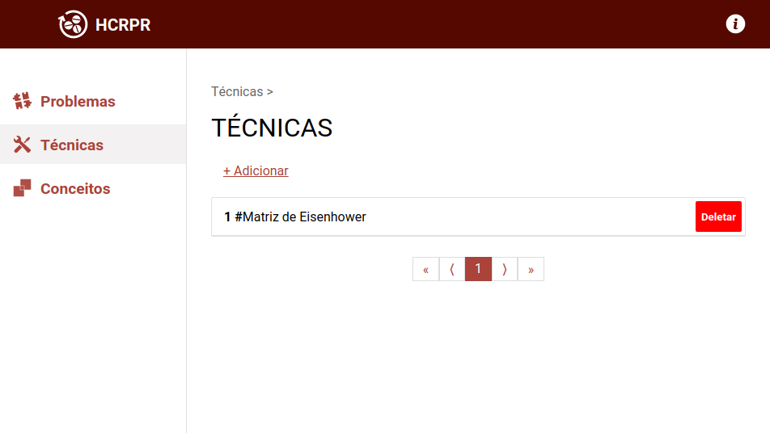

# HCRPR - Habits & Cycles Related Problems Resolver

Developed with React and Typescript.

Without automated tests.

## Screen

Screen for creating and listing techniques.

## Brief of the structure

- **Modules**: modules represents pages. One module can have layouts and components.
- **Layouts**: represents generics parts of one page, like a header or a menu.
- **Components**: represents parts that will be displayed on the page. Normally, can be reused between modules.

## Backend

Link [here](https://github.com/arielalvesdutra/hcrpr-backend).

## Brief example of a situation of use (in portuguese)

- **Contexto**: "vontade" de realizar 2 horas de leitura semanal
- **Problema**: não conseguir ler por falta de organização ou motivação
- **Aplicação do sistema**:
  - Cadastrar o problema
  - Descrever no problema o que motiva a realização de 2 horas de leitura semanal
  - Vincular conceitos que estão relacionados a causa do problema ou ao que pode solucionar o problema
  - Adicionar comentários sobre a verificação do problema
  - Adicionar "tentativas de solução" do problema
    - É possível adicionar comentários sobre o andamento da tentativa
    - É possível vincular técnicas que serão utilizadas na tentativa para resolver o problema
  - Os problemas a serem solucionados podem durar anos até que se resolvam. Não é intenção do sistema trazer um auxilio para um solução rápida. A resolução do problema pode ser rápida ou demorar bastante. O sistema serve como um guia ao longo do tempo sobre o que foi feito para resolver ele, também como a mudança de perspectivas da pessoa ao longo do tempo.
  
